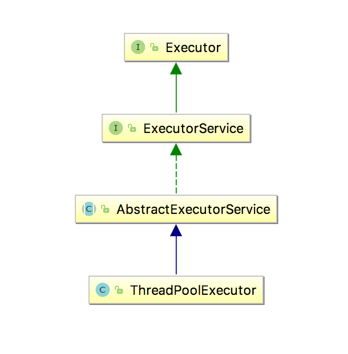

## thread pool

### 前言
thread pool通过事先创建线程，执行任务，通常是解决线程循环开销资源的一个解决方案. 
当请求来时，线程已经存在,省掉了线程的创建时间，使应用创建更加迅速。

* Java提供了一个Executor框架，其中以Executor接口为中心,其子接口–ExecutorService,子类-ThreadPoolExecutor, 关系如下图. 使用executor只需要事先一个Runnable对象，然后把它发给executor执行.
* 它使得我们可以使用多线程的优点，但是仅关注需要执行的线程，而不关注线程的技术；
* 使用线程池,我们需要先创建一个ExecutorService对象然后传递批量任务给它. ThreadPoolExecutor 有2个参数 core、 maximum可设置线程池初始和最大大小.具体的任务在具体的线程中按顺序执行；

### Executor Thread Pool Methods

|方法|描述|
|--|--|
|newFixedThreadPool(int) |创建一个固定大小的线程池|
|newCachedThreadPool()|创建一个根据需要创建线程的线程池|
|newSingleThreadExecutor() |创建一个单线程|
        
### 创建线程的步骤

1. 创建一个将被执行的任务(Runnable Object) 
2. 创建一个使用Executors创建一个线程池
3. 把任务传递给线程池
4. 关闭线程池
1.  完整代码
  * [Task.java](/src/main/java/org/nick/threadpooldemo/simple/Task.java)
  * [Test.java](/src/main/java/org/nick/threadpooldemo/simple/Test.java)

可以看到线程1、2、3立即执行，4、5待线程1、2、3执行完毕之后继续执行；

### 使用线程池的风险

* Deadlock 
* Thread Leakage 
* Resource Thrashing 